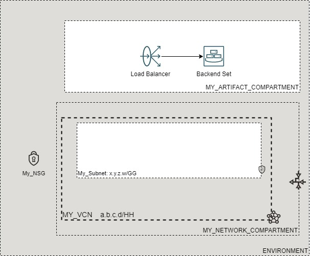

# OCI Cloud Bricks: Load Balancer Backend Set

[](https://img.shields.io/badge/license-UPL-green) [](https://sonarcloud.io/dashboard?id=oracle-devrel_terraform-oci-cloudbricks-lbaas-bes-single)

## Introduction
The following brick contains the logic to provision a single decoupled Application, Network or Instance Pool Backend Set, pointing to a single listen port.

## Reference Architecture
The following is the reference architecture associated to this brick



### Prerequisites
- Pre-baked Artifact and Network Compartments
- Pre-baked VCN
- Pre-baked load balancer

---

# Sample tfvars file

If using an Application Backend Set, with No SSL and No Routing Policy.

```shell
########## Application Backend Set, No SSL, No Routing Policy ##########
########## SAMPLE TFVAR FILE ##########
######################################## COMMON VARIABLES ######################################
region           = "foo-region-1"
tenancy_ocid     = "ocid1.tenancy.oc1..abcdefg"
user_ocid        = "ocid1.user.oc1..aaaaaaabcdefg"
fingerprint      = "fo:oo:ba:ar:ba:ar"
private_key_path = "/absolute/path/to/api/key/your_api_key.pem"
######################################## COMMON VARIABLES ######################################
######################################## ARTIFACT SPECIFIC VARIABLES ######################################
lbaas_bes_single_instance_compartment_name = "MY_ARTIFACT_COMPARTMENT"
lbaas_bes_single_network_compartment_name  = "MY_NETWORK_COMPARTMENT"
vcn_display_name                           = "MY_VCN"
network_subnet_name                        = "MY_SUBNET"
backend_set_name                           = "MY_BES_NAME"
check_protocol                             = "TCP"
checkport                                  = "22"
listener_name                              = "MY_LISTENER_NAME"
listen_port                                = "80"
listen_protocol                            = "HTTP"
backend_port                               = "80"
session_persistance_cookie_name            = "MY_COOKIE_NAME"
load_balancer_id                           = "ocid1.loadbalancer.oc1.uk-london-1.aaaaaaaabdefgh"
lbaas_policy                               = "ROUND_ROBIN"
is_app_bes                                 = true
######################################## ARTIFACT SPECIFIC VARIABLES ######################################
########## SAMPLE TFVAR FILE ##########
########## Application Backend Set, No SSL, No Routing Policy ##########
```

If using an Application Backend Set, with No SSL and A Routing Policy.

```shell
########## Application Backend Set, No SSL, Routing Policy ##########
########## SAMPLE TFVAR FILE ##########
######################################## COMMON VARIABLES ######################################
region           = "foo-region-1"
tenancy_ocid     = "ocid1.tenancy.oc1..abcdefg"
user_ocid        = "ocid1.user.oc1..aaaaaaabcdefg"
fingerprint      = "fo:oo:ba:ar:ba:ar"
private_key_path = "/absolute/path/to/api/key/your_api_key.pem"
######################################## COMMON VARIABLES ######################################
######################################## ARTIFACT SPECIFIC VARIABLES ######################################
lbaas_bes_single_instance_compartment_name = "MY_ARTIFACT_COMPARTMENT"
lbaas_bes_single_network_compartment_name  = "MY_NETWORK_COMPARTMENT"
vcn_display_name                           = "MY_VCN"
network_subnet_name                        = "MY_SUBNET"
backend_set_name                           = "MY_BES_NAME"
check_protocol                             = "TCP"
checkport                                  = "22"
listener_name                              = "MY_LISTENER_NAME"
listen_port                                = "80"
listen_protocol                            = "HTTP"
backend_port                               = "80"
session_persistance_cookie_name            = "MY_COOKIE_NAME"
load_balancer_id                           = "ocid1.loadbalancer.oc1.uk-london-1.aaaaaaaabdefgh"
lbaas_policy                               = "ROUND_ROBIN"
is_app_bes                                 = true

routing_policy_condition_language_version = "V1"
routing_policy_name                       = "MY_ROUTING_POLICY_NAME"
routing_policy_actions_name               = "FORWARD_TO_BACKENDSET"
routing_policy_conditions                 = { "unitaryroutingpolicyrule1" : "any(http.request.url.path eq (i '/test1')" } 
######################################## ARTIFACT SPECIFIC VARIABLES ######################################
########## SAMPLE TFVAR FILE ##########
########## Application Backend Set, No SSL, Routing Policy ##########
```

If using an Application Backend Set, with SSL and No Routing Policy.

```shell
########## Application Backend Set, SSL, No Routing Policy ##########
########## SAMPLE TFVAR FILE ##########
######################################## COMMON VARIABLES ######################################
region           = "foo-region-1"
tenancy_ocid     = "ocid1.tenancy.oc1..abcdefg"
user_ocid        = "ocid1.user.oc1..aaaaaaabcdefg"
fingerprint      = "fo:oo:ba:ar:ba:ar"
private_key_path = "/absolute/path/to/api/key/your_api_key.pem"
######################################## COMMON VARIABLES ######################################
######################################## ARTIFACT SPECIFIC VARIABLES ######################################
lbaas_bes_single_instance_compartment_name = "MY_ARTIFACT_COMPARTMENT"
lbaas_bes_single_network_compartment_name  = "MY_NETWORK_COMPARTMENT"
vcn_display_name                           = "MY_VCN"
network_subnet_name                        = "MY_SUBNET"
backend_set_name                           = "MY_BES_NAME"
check_protocol                             = "TCP"
checkport                                  = "22"
listener_name                              = "MY_LISTENER_NAME"
listen_port                                = "443"
listen_protocol                            = "HTTP"
backend_port                               = "443"
session_persistance_cookie_name            = "MY_COOKIE_NAME"
load_balancer_id                           = "ocid1.loadbalancer.oc1.uk-london-1.aaaaaaaabdefgh"
lbaas_policy                               = "ROUND_ROBIN"
is_app_bes                                 = true

certificate_name        = "MY_CERTIFICATE_NAME"
lbaas_cert_is_path      = true
lbaas_ca_cert           = "/absolute/path/to/your/ca/certificate/your_certificate_name.crt"
certificate_passphrase  = "MY_CERTIFICATE_PASSPHRASE"
lbaas_pvt_key_is_path   = true
certificate_private_key = "/absolute/path/to/your/certificate/private/key/your_private_key_name.pem"
lbaas_pub_cert_is_path  = true
lbaas_public_cert       = "/absolute/path/to/your/public/certificate/your_public_certificate_name.crt"
verify_peer_certificate = false
######################################## ARTIFACT SPECIFIC VARIABLES ######################################
########## SAMPLE TFVAR FILE ##########
########## Application Backend Set, SSL, No Routing Policy ##########
```

If using an Application Backend Set, with SSL and A Routing Policy.

```shell
########## Application Backend Set, SSL, Routing Policy ##########
########## SAMPLE TFVAR FILE ##########
######################################## COMMON VARIABLES ######################################
region           = "foo-region-1"
tenancy_ocid     = "ocid1.tenancy.oc1..abcdefg"
user_ocid        = "ocid1.user.oc1..aaaaaaabcdefg"
fingerprint      = "fo:oo:ba:ar:ba:ar"
private_key_path = "/absolute/path/to/api/key/your_api_key.pem"
######################################## COMMON VARIABLES ######################################
######################################## ARTIFACT SPECIFIC VARIABLES ######################################
lbaas_bes_single_instance_compartment_name = "MY_ARTIFACT_COMPARTMENT"
lbaas_bes_single_network_compartment_name  = "MY_NETWORK_COMPARTMENT"
vcn_display_name                           = "MY_VCN"
network_subnet_name                        = "MY_SUBNET"
backend_set_name                           = "MY_BES_NAME"
check_protocol                             = "TCP"
checkport                                  = "22"
listener_name                              = "MY_LISTENER_NAME"
listen_port                                = "80"
listen_protocol                            = "HTTP"
backend_port                               = "80"
session_persistance_cookie_name            = "MY_COOKIE_NAME"
load_balancer_id                           = "ocid1.loadbalancer.oc1.uk-london-1.aaaaaaaabdefgh"
lbaas_policy                               = "ROUND_ROBIN"
is_app_bes                                 = true

certificate_name        = "MY_CERTIFICATE_NAME"
lbaas_cert_is_path      = true
lbaas_ca_cert           = "/absolute/path/to/your/ca/certificate/your_certificate_name.crt"
certificate_passphrase  = "MY_CERTIFICATE_PASSPHRASE"
lbaas_pvt_key_is_path   = true
certificate_private_key = "/absolute/path/to/your/certificate/private/key/your_private_key_name.pem"
lbaas_pub_cert_is_path  = true
lbaas_public_cert       = "/absolute/path/to/your/public/certificate/your_public_certificate_name.crt"
verify_peer_certificate = false

routing_policy_condition_language_version = "V1"
routing_policy_name                       = "MY_ROUTING_POLICY_NAME"
routing_policy_actions_name               = "FORWARD_TO_BACKENDSET"
routing_policy_conditions                 = { "unitaryroutingpolicyrule1" : "any(http.request.url.path eq (i '/test1')" } 
######################################## ARTIFACT SPECIFIC VARIABLES ######################################
########## SAMPLE TFVAR FILE ##########
########## Application Backend Set, SSL, Routing Policy ##########
```

If using a Network Backend Set.

```shell
########## Network Backend Set ##########
########## SAMPLE TFVAR FILE ##########
######################################## COMMON VARIABLES ######################################
region           = "foo-region-1"
tenancy_ocid     = "ocid1.tenancy.oc1..abcdefg"
user_ocid        = "ocid1.user.oc1..aaaaaaabcdefg"
fingerprint      = "fo:oo:ba:ar:ba:ar"
private_key_path = "/absolute/path/to/api/key/your_api_key.pem"
######################################## COMMON VARIABLES ######################################
######################################## ARTIFACT SPECIFIC VARIABLES ######################################
lbaas_bes_single_instance_compartment_name = "MY_ARTIFACT_COMPARTMENT"
lbaas_bes_single_network_compartment_name  = "MY_NETWORK_COMPARTMENT"
vcn_display_name                           = "MY_VCN"
network_subnet_name                        = "MY_SUBNET"
backend_set_name                           = "MY_BES_NAME"
check_protocol                             = "TCP"
checkport                                  = "22"
listener_name                              = "MY_LISTENER_NAME"
listen_port                                = "80"
listen_protocol                            = "TCP"
backend_port                               = "80"
load_balancer_id                           = "ocid1.loadbalancer.oc1.uk-london-1.aaaaaaaabdefgh"
lbaas_policy                               = "FIVE_TUPLE"
is_network_bes                             = true
backend_set_is_preserve_source             = true
######################################## ARTIFACT SPECIFIC VARIABLES ######################################
########## SAMPLE TFVAR FILE ##########
########## Network Backend Set ##########
```

If using an Instance Pool Backend Set.

```shell
########## Instance Pool Backend Set ##########
########## SAMPLE TFVAR FILE ##########
######################################## COMMON VARIABLES ######################################
region           = "foo-region-1"
tenancy_ocid     = "ocid1.tenancy.oc1..abcdefg"
user_ocid        = "ocid1.user.oc1..aaaaaaabcdefg"
fingerprint      = "fo:oo:ba:ar:ba:ar"
private_key_path = "/absolute/path/to/api/key/your_api_key.pem"
######################################## COMMON VARIABLES ######################################
######################################## ARTIFACT SPECIFIC VARIABLES ######################################
lbaas_bes_single_instance_compartment_name = "MY_ARTIFACT_COMPARTMENT"
lbaas_bes_single_network_compartment_name  = "MY_NETWORK_COMPARTMENT"
vcn_display_name                           = "MY_VCN"
network_subnet_name                        = "MY_SUBNET"
backend_set_name                           = "MY_BES_NAME"
check_protocol                             = "TCP"
checkport                                  = "22"
backend_port                               = "80"
load_balancer_id                           = "ocid1.loadbalancer.oc1.uk-london-1.aaaaaaaabdefgh"
lbaas_policy                               = "ROUND_ROBIN"
is_instancepool_bes                        = true
session_persistance_cookie_name            = "MY_COOKIE_NAME"
######################################## ARTIFACT SPECIFIC VARIABLES ######################################
########## SAMPLE TFVAR FILE ##########
########## Instance Pool Backend Set ##########
```

### Variable Specific Conisderions
- Variable `balanced_artifact` is used to supply the names and private IP addresses of instances. It is only used with Application and Instance Pool backend sets. You will pass a list of created instances into this variable on the frontend and they will be inserted into the backend set.
- Variable `checkport` is the backend server port to use for health checks.
- Variable `backend_port` is the port to communicate with the backend instances.
- Variable `listen_port` is the port used by the listener to direct traffic to the backends.

#### Application Load Balancer Specific:
- Variable `listen_protocol` has options `HTTP`, `HTTP2` and `TCP`. If you want to use SSL, then make sure `listen_port` is set to `443` and all the SSL variables are correctly defined.
- Variable `routing_policy_conditions` contains the routing rules to evaluate defined conditions against the incoming HTTP request and perform an action. For more information on how to write routing rules visit: [Routing Policy Language](https://docs.oracle.com/en-us/iaas/Content/Balance/Concepts/routing_policy_conditions.htm)

#### Application and Instance Pool Load Balancer Specific:
- Variable `lbaas_policy` can be set to `ROUND_ROBIN`, `LEAST_CONNECTIONS` or `IP_HASH`.
- Variable `session_persistance_cookie_name` is the name of the cookie inserted by the load balancer. If this field is not configured, the cookie name defaults to `X-Oracle-BMC-LBS-Route`.

#### Network Load Balancer Specific:

- Variable `lbaas_policy` can be set to `FIVE_TUPLE`, `THREE_TUPLE` or `TWO_TUPLE`
- Variable `listen_protocol` has options `ANY`, `UDP` or `TCP`. For public network load balancers, `ANY` protocol refers to `TCP/UDP`. For private network load balancers, `ANY` protocol refers to `TCP/UDP/ICMP` (note that `ICMP` requires `backend_set_is_preserve_source` to be set to `true`). 
  - *Note*: When setting `listen_protocol` to `ANY`, `listen_port` and `backend_port` can both be set to the wildcard `0` to allow all protocols. `checkport` must still be set to some value to perform health checks on the backend set. Example: `22`

---

### Sample provider
The following is the base provider definition to be used with this module

```shell
terraform {
  required_version = ">= 0.13.5"
}
provider "oci" {
  region       = var.region
  tenancy_ocid = var.tenancy_ocid
  user_ocid        = var.user_ocid
  fingerprint      = var.fingerprint
  private_key_path = var.private_key_path
  disable_auto_retries = "true"
}

provider "oci" {
  alias        = "home"
  region       = data.oci_identity_region_subscriptions.home_region_subscriptions.region_subscriptions[0].region_name
  tenancy_ocid = var.tenancy_ocid  
  user_ocid        = var.user_ocid
  fingerprint      = var.fingerprint
  private_key_path = var.private_key_path
  disable_auto_retries = "true"
}
```

## Requirements

No requirements.

## Providers

| Name | Version |
|------|---------|
| <a name="provider_oci"></a> [oci](#provider\_oci) | 4.40.0 |

## Modules

No modules.

## Resources

| Name | Type |
|------|------|
| [oci_load_balancer_backend.ApplicationBackend](https://registry.terraform.io/providers/hashicorp/oci/latest/docs/resources/load_balancer_backend) | resource |
| [oci_load_balancer_backend_set.ApplicationBackendSet](https://registry.terraform.io/providers/hashicorp/oci/latest/docs/resources/load_balancer_backend_set) | resource |
| [oci_load_balancer_backend_set.InstancePoolBackendSet](https://registry.terraform.io/providers/hashicorp/oci/latest/docs/resources/load_balancer_backend_set) | resource |
| [oci_load_balancer_certificate.ApplicationLoadBalancerCertificate](https://registry.terraform.io/providers/hashicorp/oci/latest/docs/resources/load_balancer_certificate) | resource |
| [oci_load_balancer_hostname.ApplicationBalanced_Artifact](https://registry.terraform.io/providers/hashicorp/oci/latest/docs/resources/load_balancer_hostname) | resource |
| [oci_load_balancer_listener.ApplicationLBaaSListener](https://registry.terraform.io/providers/hashicorp/oci/latest/docs/resources/load_balancer_listener) | resource |
| [oci_load_balancer_load_balancer_routing_policy.ApplicationRoutingPolicy](https://registry.terraform.io/providers/hashicorp/oci/latest/docs/resources/load_balancer_load_balancer_routing_policy) | resource |
| [oci_network_load_balancer_backend.NetworkBackend](https://registry.terraform.io/providers/hashicorp/oci/latest/docs/resources/network_load_balancer_backend) | resource |
| [oci_network_load_balancer_backend_set.NetworkBackendSet](https://registry.terraform.io/providers/hashicorp/oci/latest/docs/resources/network_load_balancer_backend_set) | resource |
| [oci_network_load_balancer_listener.NetworkLBaaSListener](https://registry.terraform.io/providers/hashicorp/oci/latest/docs/resources/network_load_balancer_listener) | resource |
| [oci_core_subnets.SUBNET](https://registry.terraform.io/providers/hashicorp/oci/latest/docs/data-sources/core_subnets) | data source |
| [oci_core_vcns.VCN](https://registry.terraform.io/providers/hashicorp/oci/latest/docs/data-sources/core_vcns) | data source |
| [oci_identity_compartments.COMPARTMENTS](https://registry.terraform.io/providers/hashicorp/oci/latest/docs/data-sources/identity_compartments) | data source |
| [oci_identity_compartments.NWCOMPARTMENTS](https://registry.terraform.io/providers/hashicorp/oci/latest/docs/data-sources/identity_compartments) | data source |

## Inputs

| Name | Description | Type | Default | Required |
|------|-------------|------|---------|:--------:|
| <a name="input_backend_port"></a> [backend\_port](#input\_backend\_port) | The port used to interact with the backend instances | `any` | n/a | yes |
| <a name="input_backend_set_is_preserve_source"></a> [backend\_set\_is\_preserve\_source](#input\_backend\_set\_is\_preserve\_source) | If this optional parameter is enabled, then the network load balancer preserves the source IP of the packet when it is forwarded to backends. Backends see the original source IP. If the isPreserveSourceDestination parameter is enabled for the network load balancer resource, then this parameter cannot be disabled. The value is true by default. | `bool` | `false` | no |
| <a name="input_backend_set_name"></a> [backend\_set\_name](#input\_backend\_set\_name) | LBaaS Backend Set Name to be provided on provisioning time | `any` | n/a | yes |
| <a name="input_balanced_artifact"></a> [balanced\_artifact](#input\_balanced\_artifact) | Integration variable which encapsulates any generic resource that may be balanced by this LBaaS | `string` | `""` | no |
| <a name="input_certificate_name"></a> [certificate\_name](#input\_certificate\_name) | A friendly name for the certificate bundle. It must be unique and it cannot be changed. Valid certificate bundle names include only alphanumeric characters, dashes, and underscores. Certificate bundle names cannot contain spaces. Avoid entering confidential information. | `string` | `""` | no |
| <a name="input_certificate_passphrase"></a> [certificate\_passphrase](#input\_certificate\_passphrase) | A passphrase for encrypted private keys. This is needed only if you created your certificate with a passphrase. | `string` | `""` | no |
| <a name="input_certificate_private_key"></a> [certificate\_private\_key](#input\_certificate\_private\_key) | The SSL private key for your certificate, in PEM format. | `string` | `""` | no |
| <a name="input_check_protocol"></a> [check\_protocol](#input\_check\_protocol) | Protocol to be used on healthcheck | `any` | n/a | yes |
| <a name="input_checkport"></a> [checkport](#input\_checkport) | Port where the healthcheck will be performed | `any` | n/a | yes |
| <a name="input_fingerprint"></a> [fingerprint](#input\_fingerprint) | API Key Fingerprint for user\_ocid derived from public API Key imported in OCI User config | `any` | n/a | yes |
| <a name="input_is_app_bes"></a> [is\_app\_bes](#input\_is\_app\_bes) | Boolean that determines if an application backend set should be provisioned or not | `bool` | `false` | no |
| <a name="input_is_instancepool_bes"></a> [is\_instancepool\_bes](#input\_is\_instancepool\_bes) | Boolean that determines if an instancepool backend set should be provisioned or not | `bool` | `false` | no |
| <a name="input_is_network_bes"></a> [is\_network\_bes](#input\_is\_network\_bes) | Boolean that determines if a network backend set should be provisioned or not | `bool` | `false` | no |
| <a name="input_lbaas_bes_single_instance_compartment_name"></a> [lbaas\_bes\_single\_instance\_compartment\_name](#input\_lbaas\_bes\_single\_instance\_compartment\_name) | LBaaS Backend Set Artifact Compartment Location | `any` | n/a | yes |
| <a name="input_lbaas_bes_single_network_compartment_name"></a> [lbaas\_bes\_single\_network\_compartment\_name](#input\_lbaas\_bes\_single\_network\_compartment\_name) | LBaaS Backend Set Network Compartment Location | `any` | n/a | yes |
| <a name="input_lbaas_ca_cert"></a> [lbaas\_ca\_cert](#input\_lbaas\_ca\_cert) | The Certificate Authority certificate, or any interim certificate, that you received from your SSL certificate provider. | `string` | `""` | no |
| <a name="input_lbaas_cert_is_path"></a> [lbaas\_cert\_is\_path](#input\_lbaas\_cert\_is\_path) | Describes if LbaaS certificate is located on file or inside code | `bool` | `true` | no |
| <a name="input_lbaas_policy"></a> [lbaas\_policy](#input\_lbaas\_policy) | Load balancing policy chosen | `any` | n/a | yes |
| <a name="input_lbaas_pub_cert_is_path"></a> [lbaas\_pub\_cert\_is\_path](#input\_lbaas\_pub\_cert\_is\_path) | Describes if LbaaS public certificate is located on file or inside code | `bool` | `true` | no |
| <a name="input_lbaas_public_cert"></a> [lbaas\_public\_cert](#input\_lbaas\_public\_cert) | The SSL public certificate, in PEM format. | `string` | `""` | no |
| <a name="input_lbaas_pvt_key_is_path"></a> [lbaas\_pvt\_key\_is\_path](#input\_lbaas\_pvt\_key\_is\_path) | Describes if LbaaS certificate private key is located on file or inside code | `bool` | `true` | no |
| <a name="input_listen_port"></a> [listen\_port](#input\_listen\_port) | Port where listener will receive communication | `string` | `"0"` | no |
| <a name="input_listen_protocol"></a> [listen\_protocol](#input\_listen\_protocol) | Protocol where Listener will receive communication | `string` | `""` | no |
| <a name="input_listener_name"></a> [listener\_name](#input\_listener\_name) | Name of the listener attached to the backend LBaaS and points to backends | `string` | `""` | no |
| <a name="input_load_balancer_id"></a> [load\_balancer\_id](#input\_load\_balancer\_id) | Modular integration for receiving an already created Load balancer. Use the LBAAS service created on separate module and pass on through it | `any` | n/a | yes |
| <a name="input_network_subnet_name"></a> [network\_subnet\_name](#input\_network\_subnet\_name) | Defines the subnet display name where this resource will be created at | `any` | n/a | yes |
| <a name="input_private_key_path"></a> [private\_key\_path](#input\_private\_key\_path) | Private Key Absolute path location where terraform is executed | `any` | n/a | yes |
| <a name="input_region"></a> [region](#input\_region) | Target region where artifacts are going to be created | `any` | n/a | yes |
| <a name="input_routing_policy_actions_name"></a> [routing\_policy\_actions\_name](#input\_routing\_policy\_actions\_name) | Actions to take place when conditons are met | `string` | `""` | no |
| <a name="input_routing_policy_condition_language_version"></a> [routing\_policy\_condition\_language\_version](#input\_routing\_policy\_condition\_language\_version) | Version used to parse routing policy language | `string` | `""` | no |
| <a name="input_routing_policy_conditions"></a> [routing\_policy\_conditions](#input\_routing\_policy\_conditions) | Map of routing policy rule names to routing policy conditions | `string` | `""` | no |
| <a name="input_routing_policy_name"></a> [routing\_policy\_name](#input\_routing\_policy\_name) | Routing Policy name to be provided when provisioning | `string` | `""` | no |
| <a name="input_session_persistance_cookie_name"></a> [session\_persistance\_cookie\_name](#input\_session\_persistance\_cookie\_name) | Name of the cookie related to maintain session persistance for balanced application | `string` | `""` | no |
| <a name="input_tenancy_ocid"></a> [tenancy\_ocid](#input\_tenancy\_ocid) | OCID of tenancy | `any` | n/a | yes |
| <a name="input_user_ocid"></a> [user\_ocid](#input\_user\_ocid) | User OCID in tenancy. Currently hardcoded to user denny.alquinta@oracle.com | `any` | n/a | yes |
| <a name="input_vcn_display_name"></a> [vcn\_display\_name](#input\_vcn\_display\_name) | VCN Display name to execute lookup | `any` | n/a | yes |
| <a name="input_verify_peer_certificate"></a> [verify\_peer\_certificate](#input\_verify\_peer\_certificate) | Whether the load balancer listener should verify peer certificates | `bool` | `false` | no |

## Outputs

| Name | Description |
|------|-------------|
| <a name="output_application_bes_instance"></a> [application\_bes\_instance](#output\_application\_bes\_instance) | n/a |
| <a name="output_instancepool_bes_instance"></a> [instancepool\_bes\_instance](#output\_instancepool\_bes\_instance) | n/a |
| <a name="output_network_bes_instance"></a> [network\_bes\_instance](#output\_network\_bes\_instance) | n/a |

## Contributing
This project is open source.  Please submit your contributions by forking this repository and submitting a pull request!  Oracle appreciates any contributions that are made by the open source community.

## License
Copyright (c) 2021 Oracle and/or its affiliates.

Licensed under the Universal Permissive License (UPL), Version 1.0.

See [LICENSE](LICENSE) for more details.
